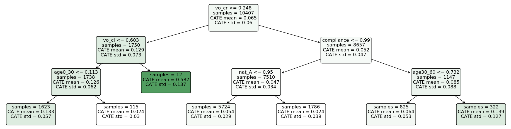

```{r setup, include=FALSE}
knitr::opts_chunk$set(echo = FALSE)
```

# Motivação {#motivacao}

### Causalidade

- Limite de velocidade reduz as mortes no trânsito?

- Permissão para cobrança de bagagem aérea reduziu o preço das tarifas?

- O recebimento de uma carta-cobrança da Receita Federal faz com que o contribuinte recolha seus impostos devidos?

- Essas questões são **causais** em sua natureza. Requerem conhecimento do processo de geração dos dados. Suas respostas não podem ser calculadas apenas com os dados observados.

### Causalidade

- Análise causal requer manipulação/intervenção no processo gerador

- Uma quebra estrutural é induzida

- Correlações anteriores não são mais válidas

- Dados puramente observacionais não carregam toda a informação necessária


### _Machine Learning sem Viés_

$$Y_i=f(\mathbf{X}_i, \epsilon_i;\theta)$$
- Causalidade requer inferência sobre parâmetros da distribuição, $\theta$

- _Machine Learning_ tradicional oferece correlações a partir de dados observacionais

- Inferência $\neq$ previsão
  + ML: minimiza $\hat e = \hat y - Y$
  + Análise causal: estima $\hat\theta$ com intervalo de confiança
  
- Boa previsão **não garante** correta estimação de parâmetros

- \textcolor{red}{Viés de regularização}: $\hat f_1(\cdot;\hat\theta_1)\approx \hat f_2(\cdot;\hat\theta_2)$ mesmo se $\hat\theta_1\neq\hat\theta_2$

### _Machine Learning sem Viés_

- Como fazer com que algoritmos de ML façam estimação causal não-viesada?

- Fronteira do conhecimento em inferência causal
  + @Chernozhukov2018 - _Double Machine Learning_
  + @Wager2018 - _Causal Forests_
  + @Syrgkanis2019 - _Doubly Robust Instrumental Variables_

# Experimento Randomizado {#experimento}

### Experimento Randomizado

- Experimentos randomizados são o padrão-ouro para inferência causal

- Re-analisaremos o trabalho de @Fellner2013 

- Correspondências fiscais para mais de 50.000 contribuintes

- Analisar efeitos de variação no conteúdo
  + Valores médios por tipo de carta
  + Heterogeneidade nos efeitos


### Descrição do Experimento

\begin{table}[H]

\centering
\begin{tabular}[t]{llrr}
\toprule
Tratamento & Descrição & Observações & Proporção\\
\midrule
T0 & Sem Correio & 2586 & 0.0512099\\
T1 & Correio & 7984 & 0.1581053\\
T2 & Ameaça & 7821 & 0.1548774\\
T3 & Info & 7998 & 0.1583825\\
T4 & Info\&Ameaça & 8101 & 0.1604222\\
T5 & Moral & 8084 & 0.1600855\\
T6 & Moral\&Ameaça & 7924 & 0.1569171\\
\bottomrule
\end{tabular}
\end{table}

### Problema de Atrito

- Atrito: contribuintes que deveriam receber a correspondência mas não foram encontrados
- Pode comprometer a aleatorização do experimento e **gerar viés** na inferência

\begin{table}[H]
\centering
\begin{threeparttable}
\footnotesize
\begin{tabular}[t]{llrrr}

\toprule
Tratamento & Descrição & Cartas & Não Entregues & Taxa Atrito\\
\midrule
T1 & Correio & 7984 &  1126 & 0.1410\\
T2 & Ameaça & 7821 &  1127 & 0.1441\\
T3 & Info & 7998 &  1173 & 0.1467\\
T4 & Info\&Ameaça & 8101 &  1141 & 0.1408\\
T5 & Moral & 8084 &  1164 & 0.1440\\
\addlinespace
T6 & Moral\&Ameaça & 7924 & 1174 & 0.1482\\
\bottomrule
\end{tabular}
\end{threeparttable}
\end{table}


### Análise Exploratória

- Uma boa aleatorização implica em balanceamento das covariadas _(features)_ entre os tratamentos

\begin{table}[H]
\centering
\fontsize{8}{10}\selectfont
\begin{threeparttable}
\begin{tabular}[t]{llrrrrrr}
\toprule
Tratamento & Descrição & Gênero & Idade & Renda & População & Dens. pop. & Compliance\\
\midrule
T0 & Sem Correio & 0.6458 & 48.0170 & 20928.4068 & 45815.2715 & 8.1711 & 0.9355\\
T1 & Correio & 0.6338 & 47.9969 & 20878.9958 & 43377.1935 & 8.5625 & 0.9352\\
T2 & Ameaça & 0.6367 & 47.9931 & 20901.1614 & 44542.5883 & 7.9605 & 0.9346\\
T3 & Info & 0.6260 & 48.0300 & 20882.6636 & 43903.0189 & 8.1142 & 0.9347\\
T4 & Info\&Ameaça & 0.6335 & 48.0051 & 20879.6138 & 43319.4736 & 8.3540 & 0.9352\\
\addlinespace
T5 & Moral & 0.6251 & 47.9982 & 20888.4584 & 44301.3718 & 8.4832 & 0.9343\\
T6 & Moral\&Ameaça & 0.6422 & 47.9904 & 20876.3062 & 43610.1972 & 8.0468 & 0.9343\\
\midrule
Anova: & p-values & 0.1715 & 0.3993 & 0.9393 & 0.7577 & 0.5795 & 0.8614\\
\bottomrule
\end{tabular}
\end{threeparttable}
\end{table}

### Análise Exploratória

- Atrito pode quebrar o balanceamento e comprometer a aleatorização

\begin{table}[H]
\centering
\fontsize{8}{10}\selectfont
\begin{threeparttable}
\begin{tabular}[t]{lrrrrrr}
\toprule
Tratamento & Gênero & Idade & Renda & População & Dens. pop. & Compliance\\
\midrule
T0 & 0.6458 & 48.0170 & 20928.4068 & 45815.2715 & 8.1711 & 0.9355\\
T1 & 0.6403 & 47.7868 & 21100.3921 & 52084.9822 & 7.6001 & 0.9322\\
T2 & 0.6211 & 47.7127 & 21106.0117 & 48882.0302 & 6.5860 & 0.9337\\
T3 & 0.6138 & 47.8580 & 21077.8894 & 51027.8338 & 6.6317 & 0.9313\\
T4 & 0.6240 & 47.8056 & 20945.2352 & 48251.5259 & 6.5957 & 0.9318\\
\addlinespace
T5 & 0.6177 & 47.7952 & 20864.3756 & 43273.7019 & 6.3919 & 0.9308\\
T6 & 0.6320 & 47.8117 & 20966.9995 & 46539.3467 & 6.4614 & 0.9324\\
\midrule
Anova p-valor & 0.4319 & 0.0000 & 0.0095 & 0.0936 & 0.0094 & 0.1122\\
\bottomrule
\end{tabular}
\end{threeparttable}
\end{table}


# Modelos e Resultados

### Estimandos Causais

- _Framework_ de Resultados potenciais. Observamos apenas um resultado potencial dado um tratamento. \textcolor{red}{Problema fundamental da inferência causal}

$$Y_i=D_i\cdot Y_i(1)+(1-D_i)\cdot Y_i(0), \quad D_i\in\{0, 1\}$$

- Estimandos Casusais:

\vspace{-1em}
\begin{align*}
    ATE&=\mathbb{E}[Y_i(1)-Y_i(0)], \qquad\qquad\, CATE(x)=\mathbb{E}[Y_i(1)-Y_i(0)|\mathbf{X}=x]\\
    ATT&=\mathbb{E}[Y_i(1)-Y_i(0)|D_i=1], \quad CATT(x)=\mathbb{E}[Y_i(1)-Y_i(0)|\mathbf{X}=x, D_i=1]\\
     LAT&E(x)=\frac{\mathbb{E}[Y_i(1, D_i(1))-Y_i(0, D_i(0))]}{\mathbb{E}[D_i(1)-D_i(0)]}
\end{align*}

### Hipóteses de Identificação

- SUTVA: **não existe interferência** entre os indivíduos tratados e não tratados. Não pode haver efeitos de transbordamento do tratamento de algum indivíduo para outro que esteja no grupo de controle

- CIA _(unconfoundedness)_: **condicionado às características observadas**, $\mathbf{X}_i$, os resultados potenciais são **independentes** do tratamento $D_i$,  $\{Y_i(1), Y_i(0)\} \perp D_i|\mathbf{X}_i$

Quando usamos variáveis instrumentais

- Exclusão do instrumento: designação para tratamento **não afeta diretamente** os resultados potenciais

- Relevância do instrumento: designação para o tratamento aumenta a probabilidade de ser tratado. $\mathbb{E}[D_i(1)-D_i(0)]>0$

### Modelo ForestDML

- Modelo parcialmente linear. Tratamento $T$ é exógeno, não é necessária instrumentalização

\vspace{-1em}
\begin{align*}
    Y&=\theta(\bfx) \cdot T+g(\bfx, \bfw)+\epsilon  &\mathbb{E}[\epsilon \mid \bfx, \bfw]=0 \\
    T&=f(\bfx, \bfw)+\eta &\mathbb{E}[\eta \mid \bfx, \bfw]=0 \\
    \mathbb{E}&[\eta \cdot \epsilon \mid \bfx, \bfw]=0
\end{align*}

- Através de \textcolor{red}{DML} (ortogonalização de Neyman e _cross-fitting_)

\vspace{-1em}
\begin{equation*}
\hat{\theta}(x)=\argmin_{\theta} \sum_{i=1}^{n} K_{x}\left(X_{i}\right) \cdot\left(Y_{i}-\hat{q}\left(X_{i}, W_{i}\right)-\theta \cdot\left(T_{i}-\hat{f}\left(X_{i}, W_{i}\right)\right)\right)^{2}
\end{equation*}

- _Kernel_ $K_x$ é uma \textcolor{red}{floresta causal}

### Modelo DRIV

- Tratamento é endógeno. Necessita de variável instrumental

\vspace{-1em}
\begin{align*}
    Y&=\theta(\bfx)\cdot T+g(\bfx)+\epsilon, &\mathbb{E}[\epsilon\mid \bfx, Z]=0\\
    Z&=m(\bfx)+\eta, &\mathbb{E}[\eta\mid\bfx]=0\\
    \mathbb{E}&[\eta\cdot\epsilon\mid \bfx, Z]=0\\
    \mathbb{E}&[T\cdot\epsilon\mid\bfx]\neq 0
\end{align*}

- Estimativa preliminar de $\theta(x)$ e algoritmo _Doubly Robust_

\vspace{-1em}
\begin{equation*}
\hat{\theta}_{DR}(x)=\argmin_{\theta}\sum_{i\in\mathcal{I}}\left(\theta_{\text {pre }}(x)+\frac{\left(\hat{\tilde{Y}}_i-\theta_{\text {pre }}(x) \hat{\tilde{T}}_i\right) \hat{\tilde{Z}}_i}{\hat\beta(X_i)}-\theta(X_i)\right)^{2}
\end{equation*}

### Resultados

- Receber uma correspondência \textcolor{red}{tem efeito positivo} sobre o registro para pagamento do tributo
- Uma **ameaça** na carta aumenta este efeito
- Informações e apelo moral não possui efeito estatisticamente significativo

\begin{table}[H]
\centering
\fontsize{8}{10}\selectfont
\begin{tabular}{lccccc}
\toprule\toprule
 & OLS & \multicolumn{2}{c}{ForestDML} & IV2SLS &   DRIV \\
% \cmidrule{2-3}\cmidrule{4}\cmidrule{5}\\
 &    ATE &   ATE &    ATT &   LATE &   LATE \\
\midrule
Correio & 0,0650  & 0,0766 & 0,0766 & 0,0767 & 0,0588 \\
\textbf{Ameaça}  & \textbf{0,0750}  & \textbf{0,0850} & \textbf{0,0848} & \textbf{0,0872} & \textbf{0,0650} \\
Info    & 0,0646  & 0,0762 & 0,0760 & 0,0728 & 0,0547 \\
Moral   & 0,0648  & 0,0695 & 0,0695 & 0,0724 & 0,0513 \\
\bottomrule\bottomrule
\end{tabular}
\end{table}


### Efeitos Heterogêneos

- Existem características que moderam o efeito causal?
- Heterogeneidade: efeito causal depende de características individuais
- Regressão linear
  + \textcolor{green}{Simples estimação e interpretação}
  + \textcolor{red}{Hipótese a priori das características}
- _Machine Learning_
  + \textcolor{green}{descobre a heterogeneidade presente nos dados}
  + \textcolor{red}{modelos mais complexos}
- Árvores de decisão são um bom compromisso. Aliam interpretabilidade com algoritmo _data-driven_

***

```{r arvore, out.width=400, fig.align='center'}

```

# Conclusão

- Árvores de decisão são de fácil interpretação. Conjunto de regras

- Fornece informação sobre as características mais relevantes para detectar efeitos heterogêneos

- Os métodos de DML e Causal Forests estimam efeitos livres de viés, heterogêneos e não-paramétricos

- Com base nestas estimações, uma **política ótima** de tratamento pode ser implementada, focando nos indivíduos com maior potencial de resposta

### Referências {.allowframebreaks}
\scriptsize
