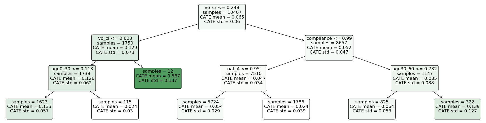

```{r setup, include=FALSE, cache=FALSE}
options(htmltools.dir.version = FALSE)
options(knitr.table.format = "html")
# Set global knitr chunk options
knitr::opts_chunk$set(
  fig.align = "center", 
  fig.retina = 3,
  fig.width = 7,
  out.width = "80%",
  fig.asp = 9/16,
  cache = FALSE,
  error = FALSE,
  message = FALSE, 
  warning = FALSE, 
  collapse = TRUE ,
  echo = FALSE
)

library(ggplot2)
library(patchwork)
library(kableExtra)
library(fontawesome)
library(RefManageR)
BibOptions(check.entries = FALSE, 
           bib.style = "authoryear", 
           cite.style = 'authoryear', 
           style = "markdown",
           hyperlink = TRUE, 
           dashed = TRUE,
           check.entries = FALSE)
bib <- ReadBib("Bibliografia.bib")
```

# Motivação

Causalidade

- Limite de velocidade reduz as mortes no trânsito?

--

- Permissão para cobrança de bagagem aérea reduziu o preço das tarifas?

--

- O recebimento de uma carta-cobrança da Receita Federal faz com que o contribuinte recolha seus impostos devidos?

--

- Essas questões são **causais** em sua natureza. Requerem conhecimento do processo de geração dos dados. Suas respostas não podem ser calculadas apenas com os dados observados.

---
# Causalidade

- Análise causal requer **manipulação/intervenção** no processo gerador

--
- Uma .red[quebra estrutural] é induzida

--
- Correlações anteriores não são mais válidas

--
- Dados puramente observacionais não carregam toda a informação necessária

--

DAG causal de Judea Pearl

```{r dag, out.width="80%"}

```

---
# _Machine Learning sem Viés_

$$Y_i=f(\mathbf{X}_i, \epsilon_i;\theta)$$
- Causalidade requer inferência sobre parâmetros da distribuição, $\theta$

- _Machine Learning_ tradicional oferece correlações a partir de dados observacionais

- Inferência $\neq$ previsão
  + ML: minimiza $\hat e = \hat y - Y$
  + Análise causal: estima $\hat\theta$ com intervalo de confiança
  
- Boa previsão **não garante** correta estimação de parâmetros

- .red[Viés de regularização]: $\hat f_1(\cdot;\hat\theta_1)\approx \hat f_2(\cdot;\hat\theta_2)$ mesmo se $\hat\theta_1\neq\hat\theta_2$

---
# _Machine Learning sem Viés_

- Como fazer com que algoritmos de ML façam estimação causal não-viesada?

- Fronteira do conhecimento em inferência causal
  + `r Citet(bib, "Chernozhukov2018")` - _Double Machine Learning_
  + `r Citet(bib, "Wager2018")` - _Causal Forests_
  + `r Citet(bib, "Syrgkanis2019")` - _Doubly Robust Instrumental Variables_

---
class: clear, middle, center

background-image: url(Figs/experimento.jpeg)
background-size: cover

# .shade[Experimento Randomizado]

---
# Experimento Randomizado

- Experimentos randomizados são o padrão-ouro para inferência causal

- Re-analisaremos o trabalho de `r Citet(bib, "Fellner2013")` 

- Correspondências fiscais para mais de 50.000 contribuintes

- Analisar efeitos de variação no conteúdo
  + Valores médios por tipo de carta
  + Heterogeneidade nos efeitos
  
---
# Descrição do Experimento

| Tratamento | Descrição   | Observações | Proporção  |
| :--------- | :---------- | ----------: | ---------: |
| T0         | Sem Correio | 2586        | 0\.0512099 |
| T1         | Correio     | 7984        | 0\.1581053 |
| T2         | Ameaça      | 7821        | 0\.1548774 |
| T3         | Info        | 7998        | 0\.1583825 |
| T4         | InfoAmeaça  | 8101        | 0\.1604222 |
| T5         | Moral       | 8084        | 0\.1600855 |
| T6         | MoralAmeaça | 7924        | 0\.1569171 |

---
# Problema de Atrito

- Atrito: contribuintes que deveriam receber a correspondência mas não foram encontrados
- Pode comprometer a aleatorização do experimento e **gerar viés** na inferência

| Tratamento | Descrição   | Cartas | Não Entregues | Taxa Atrito |
| :--------- | :---------- | -----: | ------------: | ----------: |
| T1         | Correio     | 7984   | 1126          | 0\.1410     |
| T2         | Ameaça      | 7821   | 1127          | 0\.1441     |
| T3         | Info        | 7998   | 1173          | 0\.1467     |
| T4         | InfoAmeaça  | 8101   | 1141          | 0\.1408     |
| T5         | Moral       | 8084   | 1164          | 0\.1440     |
| T6         | MoralAmeaça | 7924   | 1174          | 0\.1482     |

---
# Análise Exploratória

- Uma boa aleatorização implica em balanceamento das covariadas _(features)_ entre os tratamentos

| Tratamento | Descrição   | Gênero  | Idade    | Renda       | População   | Dens. pop. | Compliance |
| :--------- | :---------- | ------: | -------: | ----------: | ----------: | ---------: | ---------: |
| T0         | Sem Correio | 0\.6458 | 48\.0170 | 20928\.4068 | 45815\.2715 | 8\.1711    | 0\.9355    |
| T1         | Correio     | 0\.6338 | 47\.9969 | 20878\.9958 | 43377\.1935 | 8\.5625    | 0\.9352    |
| T2         | Ameaça      | 0\.6367 | 47\.9931 | 20901\.1614 | 44542\.5883 | 7\.9605    | 0\.9346    |
| T3         | Info        | 0\.6260 | 48\.0300 | 20882\.6636 | 43903\.0189 | 8\.1142    | 0\.9347    |
| T4         | InfoAmeaça  | 0\.6335 | 48\.0051 | 20879\.6138 | 43319\.4736 | 8\.3540    | 0\.9352    |
| T5         | Moral       | 0\.6251 | 47\.9982 | 20888\.4584 | 44301\.3718 | 8\.4832    | 0\.9343    |
| T6         | MoralAmeaça | 0\.6422 | 47\.9904 | 20876\.3062 | 43610\.1972 | 8\.0468    | 0\.9343    |
| Anova:     | p-values    | 0\.1715 | 0\.3993  | 0\.9393     | 0\.7577     | 0\.5795    | 0\.8614    |

---
# Análise Exploratória

- Atrito pode quebrar o balanceamento e comprometer a aleatorização

| Tratamento    | Gênero  | Idade    | Renda       | População   | Dens. pop. | Compliance |
| :------------ | ------: | -------: | ----------: | ----------: | ---------: | ---------: |
| T0            | 0\.6458 | 48\.0170 | 20928\.4068 | 45815\.2715 | 8\.1711    | 0\.9355    |
| T1            | 0\.6403 | 47\.7868 | 21100\.3921 | 52084\.9822 | 7\.6001    | 0\.9322    |
| T2            | 0\.6211 | 47\.7127 | 21106\.0117 | 48882\.0302 | 6\.5860    | 0\.9337    |
| T3            | 0\.6138 | 47\.8580 | 21077\.8894 | 51027\.8338 | 6\.6317    | 0\.9313    |
| T4            | 0\.6240 | 47\.8056 | 20945\.2352 | 48251\.5259 | 6\.5957    | 0\.9318    |
| T5            | 0\.6177 | 47\.7952 | 20864\.3756 | 43273\.7019 | 6\.3919    | 0\.9308    |
| T6            | 0\.6320 | 47\.8117 | 20966\.9995 | 46539\.3467 | 6\.4614    | 0\.9324    |
| Anova p-valor | 0\.4319 | 0\.0000  | 0\.0095     | 0\.0936     | 0\.0094    | 0\.1122    |

---
class: clear, middle, center

background-image: url(Figs/modelos3.jpg)
background-size: cover

# .shade[Modelos e Resultados]

---
# Estimandos Causais

- _Framework_ de Resultados potenciais. Observamos apenas um resultado potencial dado um tratamento. .red[Problema fundamental da inferência causal]

$$Y_i=D_i\cdot Y_i(1)+(1-D_i)\cdot Y_i(0), \quad D_i\in\{0, 1\}$$

- Estimandos Casusais:

$$
\begin{align*}
    ATE&=\mathbb{E}[Y_i(1)-Y_i(0)], \qquad\qquad\, CATE(x)=\mathbb{E}[Y_i(1)-Y_i(0)|\mathbf{X}=x]\\
    ATT&=\mathbb{E}[Y_i(1)-Y_i(0)|D_i=1], \quad CATT(x)=\mathbb{E}[Y_i(1)-Y_i(0)|\mathbf{X}=x, D_i=1]\\
    \\
     LAT&E(x)=\frac{\mathbb{E}[Y_i(1, D_i(1))-Y_i(0, D_i(0))]}{\mathbb{E}[D_i(1)-D_i(0)]}
\end{align*}
$$

---
# Aleatorização

- Aleatorização do tratamento elimina **viés de seleção**
  + Indivíduos podem se auto-selecionar ao tratamento devido a características peculiares
  + Escolha do tratamento está viesado e não é representativo da população
  
--

- Tratamento aleatório faz com que, .red[na média], grupo controle e tratamento tenham mesmas características

--

- Diferença entre os grupos resulta no efeito do tratamento

$$\bar Y(1)-\bar Y(0)=\mathbb{E}[Y_i(1)-Y_i(0)]$$

dado que $\mathbb{E}[Y_i(0)|D_i=1]=\mathbb{E}[Y_i(0)|D_i=0]$ devido a aleatorização.

---
# Hipóteses de Identificação

- SUTVA: **não existe interferência** entre os indivíduos tratados e não tratados. Não pode haver efeitos de transbordamento do tratamento de algum indivíduo para outro que esteja no grupo de controle

--

- CIA _(unconfoundedness)_: **condicionado às características observadas**, $\mathbf{X}_i$, os resultados potenciais são **independentes** do tratamento $D_i$,  $\{Y_i(1), Y_i(0)\} \perp D_i|\mathbf{X}_i$

--

Quando usamos variáveis instrumentais

- Exclusão do instrumento: designação para tratamento **não afeta diretamente** os resultados potenciais

- Relevância do instrumento: designação para o tratamento aumenta a probabilidade de ser tratado. $\mathbb{E}[D_i(1)-D_i(0)]>0$

---
# Modelo ForestDML

- Modelo parcialmente linear. Tratamento $T$ é exógeno, não é necessária instrumentalização

$$
\begin{align*}
    Y&=\theta(\mathbf{x}) \cdot T+g(\mathbf{x}, \mathbf{w})+\epsilon  &\mathbb{E}[\epsilon \mid \mathbf{x}, \mathbf{w}]=0 \\
    T&=f(\mathbf{x}, \mathbf{w})+\eta &\mathbb{E}[\eta \mid \mathbf{x}, \mathbf{w}]=0 \\
    \mathbb{E}&[\eta \cdot \epsilon \mid \mathbf{x}, \mathbf{w}]=0
\end{align*}
$$

--

- Através de .red[DML] (ortogonalização de Neyman e _cross-fitting_)

$$
\begin{equation*}
\hat{\theta}(x)=\underset{\theta}{argmin} \sum_{i=1}^{n} K_{x}\left(X_{i}\right) \cdot\left(Y_{i}-\hat{q}\left(X_{i}, W_{i}\right)-\theta \cdot\left(T_{i}-\hat{f}\left(X_{i}, W_{i}\right)\right)\right)^{2}
\end{equation*}
$$

--

- _Kernel_ $K_x$ é uma .red[floresta causal]

---
# Modelo DRIV

- Tratamento é endógeno. Necessita de variável instrumental

$$
\begin{align*}
    Y&=\theta(\mathbf{x})\cdot T+g(\mathbf{x})+\epsilon, &\mathbb{E}[\epsilon\mid \mathbf{x}, Z]=0\\
    Z&=m(\mathbf{x})+\eta, &\mathbb{E}[\eta\mid\mathbf{x}]=0\\
    \mathbb{E}&[\eta\cdot\epsilon\mid \mathbf{x}, Z]=0\\
    \mathbb{E}&[T\cdot\epsilon\mid\mathbf{x}]\neq 0
\end{align*}
$$

--

- Estimativa preliminar de $\theta(x)$ e algoritmo _Doubly Robust_

$$
\begin{equation*}
\hat{\theta}_{DR}(x)=\underset{\theta}{argmin}\sum_{i\in\mathcal{I}}\left(\theta_{\text {pre }}(x)+\frac{\left(\hat{\tilde{Y}}_i-\theta_{\text {pre }}(x) \hat{\tilde{T}}_i\right) \hat{\tilde{Z}}_i}{\hat\beta(X_i)}-\theta(X_i)\right)^{2}
\end{equation*}
$$

---
# Resultados

- Receber uma correspondência .red[tem efeito positivo] sobre o registro para pagamento do tributo
- Uma **ameaça** na carta aumenta este efeito
- Informações e apelo moral não possui efeito estatisticamente significativo

|              | OLS          | ForestDML   |             | IV2SLS      | DRIV        |
| :----------- | :----------: | :---------: | :---------: | :---------: | :---------: |
|              | ATE          | ATE         | ATT         | LATE        | LATE        |
| Correio      | 0,0650       | 0,0766      | 0,0766      | 0,0767      | 0,0588      |
| **Ameaça**   | **0,0750**   | **0,0850**  | **0,0848**  | **0,0872**  | **0,0650**  |
| Info         | 0,0646       | 0,0762      | 0,0760      | 0,0728      | 0,0547      |
| Moral        | 0,0648       | 0,0695      | 0,0695      | 0,0724      | 0,0513      |

---
# Efeitos Heterogêneos

- Existem características que moderam o efeito causal?
- Heterogeneidade: efeito causal depende de características individuais
- Regressão linear
  + .green[Simples estimação e interpretação]
  + .red[Hipótese a priori das características]
- _Machine Learning_
  + .green[descobre a heterogeneidade presente nos dados]
  + .red[modelos mais complexos]
- Árvores de decisão são um bom compromisso. Aliam interpretabilidade com algoritmo _data-driven_

---
# Interpretabilidade

```{r arvore, out.width="100%", fig.align='center'}

```

---
# Conclusão

- Árvores de decisão são de fácil interpretação. Conjunto de regras

- Fornece informação sobre as características mais relevantes para detectar efeitos heterogêneos

- Os métodos de DML e Causal Forests estimam efeitos livres de viés, heterogêneos e não-paramétricos

- Com base nestas estimações, uma **política ótima** de tratamento pode ser implementada, focando nos indivíduos com maior potencial de resposta

---
# Referência

```{r ref, results = 'asis'}
PrintBibliography(bib)
```
